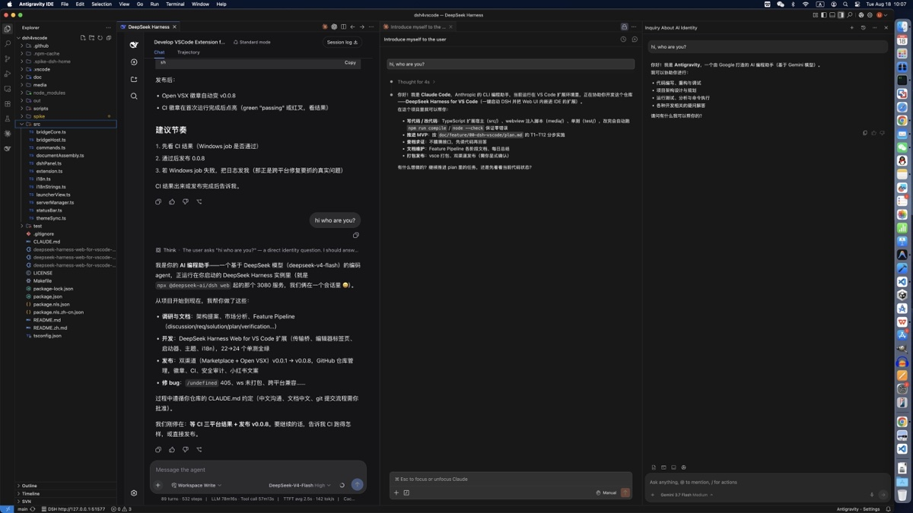

# DeepSeek Harness Web for VS Code

**English** | [中文](README.zh.md)

[](https://github.com/floatinghotpot/deepseek-harness-web-for-vscode/actions)
[](https://open-vsx.org/extension/floatinghotpot/deepseek-harness-web-for-vscode)
[](https://open-vsx.org/extension/floatinghotpot/deepseek-harness-web-for-vscode)
[](https://marketplace.visualstudio.com/items?itemName=floatinghotpot.deepseek-harness-web-for-vscode)

Launch **DeepSeek Harness** and embed its full Web UI inside VS Code (and Antigravity, the VS Code fork) — so you can run DSH agents and edit code in one window, sharing the same instance as your browser.

## Screenshot / 截图



## Features

- **Stay in your editor** — use DeepSeek Harness and write code in the same window, in **VS Code or Antigravity**; no more switching between the IDE and a browser tab to watch the agent work.
- **Bring your own LLMs** — configure DeepSeek, Claude, Gemini, or any OpenAI-compatible API in DSH settings and switch per session; run several sessions side by side (e.g., the same task in two models) to cross-review answers and cover each model's blind spots.
- **One-click start / stop** — the extension manages a `dsh web` child process with an OS-assigned port. Entry points: activity-bar icon (sidebar launcher), status-bar button, or Command Palette.
- **Embedded Web UI in an editor tab** — the full DSH frontend (conversations, workspaces, settings, plugins, Goals, Workflows) renders as a regular editor tab, side by side with your files — it never overlaps the explorer tree.
- **Works with the browser instance** — uses your `~/.dsh` by default, so sessions and settings are shared with the browser UI.
- **Current folder as workspace** — the DSH default project directory is the folder you have open.
- **Clipboard works** — copy/paste in the embedded UI goes through a transport bridge (VS Code webviews block clipboard inside iframes; the bridge routes it via `vscode.env.clipboard`).
- **Theme follows VS Code** — the embedded UI follows your editor color theme (dark/light), live on switch (`deepseekHarness.themeSync`, default `follow`).
- **Security first** — the server binds loopback only; the extension relays requests as plain Node requests, never weakening DSH's `/api` trust fence.

## Requirements

- [DeepSeek Harness](https://github.com/deepseek-ai/deepseek-harness) installed: `npm i -g @deepseek-ai/dsh`
- VS Code ≥ 1.90 (the extension also works in Antigravity via Open VSX)

## Install

- **VS Code**: [Visual Studio Marketplace](https://marketplace.visualstudio.com/) → search *DeepSeek Harness for VS Code*
- **Antigravity / Open VSX**: [Open VSX](https://open-vsx.org/) → same name

## Usage

1. Click the **DeepSeek Harness** icon in the activity bar → the launcher sidebar shows the server status.
2. Click **启动 DeepSeek Harness** (or the status-bar button, or `DeepSeek Harness: Start` from the Command Palette).
3. The DSH UI opens in an **editor tab** once the server is ready (`dsh web: http://127.0.0.1:<port>`).

To make DSH use your project as its default workspace, open that folder in the window first (the launcher footer shows the active workspace).

## Configuration

| Setting | Default | Description |
|---|---|---|
| `deepseekHarness.themeSync` | `follow` | Follow the VS Code color theme into the embedded DSH UI; `off` leaves DSH's own appearance untouched. |

## Development

```sh
npm install --cache .npm-cache
npm run compile     # tsc
npm test            # node:test unit tests
npm run package     # vsce package -> vsix
```

Press `F5` in VS Code to launch the Extension Development Host.

## Architecture

The extension spawns `dsh web --port 0`, serves the DSH frontend as same-origin webview resources, and relays `fetch` / WebSocket / clipboard through a `postMessage` bridge to the extension host, which performs the real calls as plain Node requests (passing DSH's `/api` trust fence). Design and verification notes:

- Architecture proposal: [`doc/architecture/proposal-by-deepseek.md`](doc/architecture/proposal-by-deepseek.md)
- Feature pipeline: [`doc/feature/00-dsh-vscode/`](doc/feature/00-dsh-vscode/)

## License

MIT — see [LICENSE](LICENSE). Copyright © 2026 Liming Xie.
